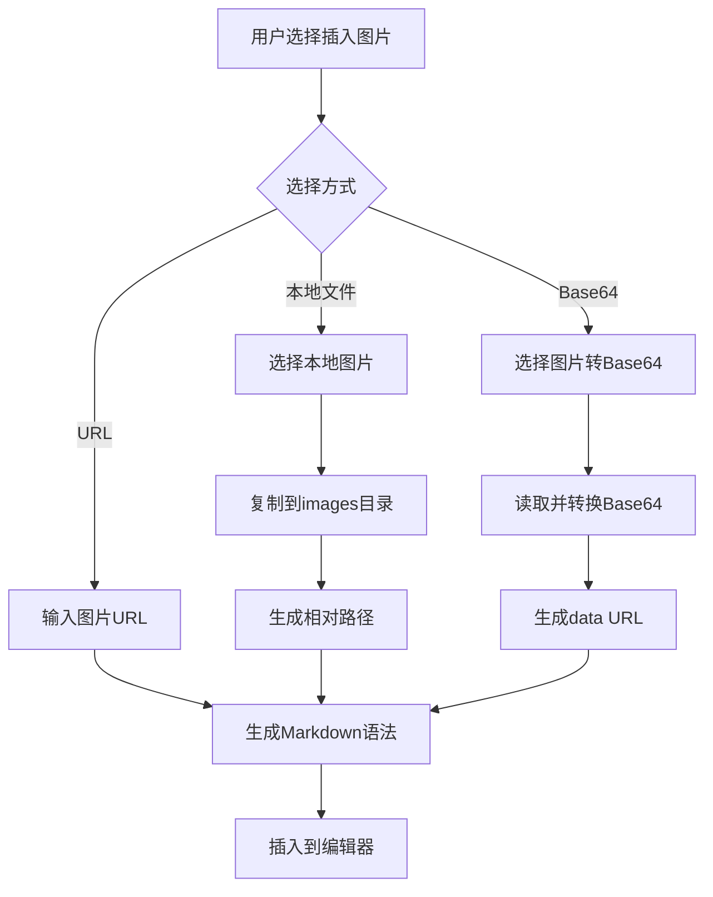
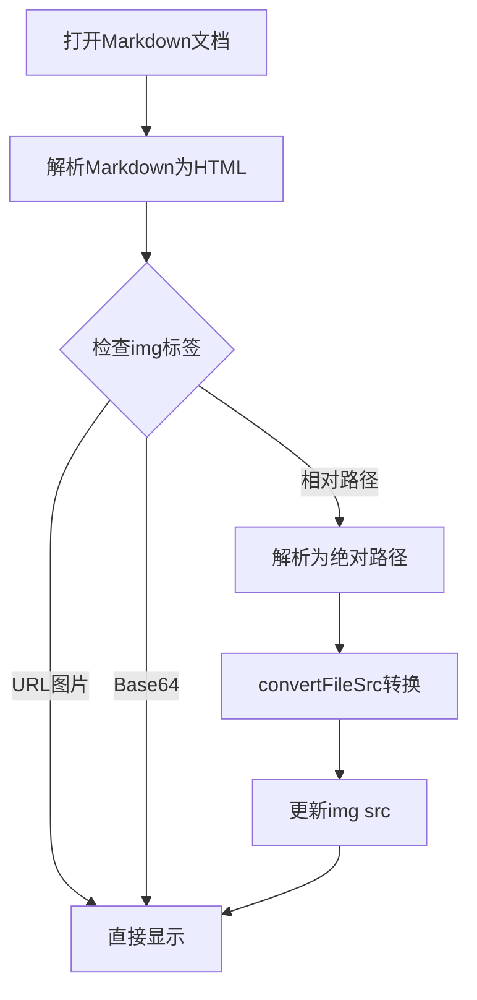

# Markdown 图片渲染设计方案

## 设计原则

1. **简单可靠**：避免复杂的路径转换和状态管理
2. **原生支持**：充分利用 Markdown 和浏览器的原生能力
3. **可移植性**：确保 Markdown 文档在不同环境下都能正常显示
4. **最小化依赖**：减少对特定框架或 API 的依赖

## 核心设计

### 1. 图片存储策略

**方案：使用相对路径 + 文档同级目录**

```
project/
├── document.md
├── images/
│   ├── image1.png
│   ├── image2.jpg
│   └── ...
```

- 所有图片统一存储在文档同级的 `images` 目录
- Markdown 中使用相对路径引用：``
- 便于文档和图片一起分享和迁移

### 2. 图片插入方式

支持三种图片插入方式：

#### 2.1 URL 图片
- 直接使用：``
- 无需本地存储，直接渲染

#### 2.2 本地文件选择
- 通过文件选择对话框选择本地图片
- 复制到文档同级的 `images` 目录
- 生成相对路径插入到 Markdown

#### 2.3 Base64 内嵌（可选）
- 小图片可以直接转换为 Base64 内嵌到 Markdown
- 格式：``
- 适合小图标或必须内嵌的场景

## 实现流程

### 1. 后端 API 设计

```rust
// 1. 复制图片到文档目录
#[tauri::command]
fn copy_image_to_document_dir(
    image_path: &str,      // 源图片路径
    document_path: &str,   // 当前文档路径
) -> Result<String, String> {
    // 1. 获取文档所在目录
    // 2. 创建 images 子目录（如果不存在）
    // 3. 生成唯一文件名（时间戳_原文件名）
    // 4. 复制图片文件
    // 5. 返回相对路径：./images/filename.png
}

// 2. 读取图片为 Base64（可选功能）
#[tauri::command]
fn read_image_as_base64(
    image_path: &str,
) -> Result<String, String> {
    // 1. 读取图片文件
    // 2. 转换为 Base64
    // 3. 返回 data URL
}
```

### 2. 前端实现

#### 2.1 图片插入对话框

```typescript
// 图片插入管理器
export class ImageInsertManager {
  constructor(private editor: Editor) {}

  // 显示插入选项
  async showInsertDialog() {
    const choice = await showDialog({
      title: '插入图片',
      options: [
        { id: 'url', label: '网络图片 URL' },
        { id: 'local', label: '本地图片文件' },
        { id: 'base64', label: '内嵌 Base64 图片' }
      ]
    });

    switch (choice) {
      case 'url':
        this.insertUrlImage();
        break;
      case 'local':
        this.insertLocalImage();
        break;
      case 'base64':
        this.insertBase64Image();
        break;
    }
  }

  // 插入 URL 图片
  private insertUrlImage() {
    const url = prompt('请输入图片 URL:');
    if (url) {
      const alt = prompt('请输入图片描述:', '') || '图片';
      this.insertMarkdown(``);
    }
  }

  // 插入本地图片
  private async insertLocalImage() {
    const selected = await open({
      filters: [{
        name: '图片',
        extensions: ['png', 'jpg', 'jpeg', 'gif', 'webp', 'svg']
      }]
    });

    if (selected) {
      const documentPath = getCurrentDocumentPath();
      if (!documentPath) {
        alert('请先保存文档');
        return;
      }

      // 复制图片到文档目录
      const relativePath = await invoke('copy_image_to_document_dir', {
        imagePath: selected,
        documentPath: documentPath
      });

      const alt = prompt('请输入图片描述:', '') || '图片';
      this.insertMarkdown(``);
    }
  }

  // 插入 Markdown 文本
  private insertMarkdown(markdown: string) {
    // 在当前光标位置插入 Markdown 文本
    const { from } = this.editor.state.selection;
    this.editor.chain()
      .focus()
      .insertContentAt(from, markdown)
      .run();
  }
}
```

#### 2.2 图片渲染处理

```typescript
// Markdown 渲染时的图片路径处理
export function processImagePaths(html: string, documentPath: string): string {
  if (!documentPath) return html;

  const parser = new DOMParser();
  const doc = parser.parseFromString(html, 'text/html');
  const images = doc.querySelectorAll('img');

  images.forEach(img => {
    let src = img.getAttribute('src');
    if (!src) return;

    // 跳过绝对 URL 和 data URL
    if (src.startsWith('http://') || 
        src.startsWith('https://') || 
        src.startsWith('data:')) {
      return;
    }

    // 处理相对路径
    if (src.startsWith('./') || src.startsWith('../')) {
      const absolutePath = resolveRelativePath(src, documentPath);
      // 使用 Tauri 的 convertFileSrc 转换为可访问的 URL
      img.setAttribute('src', convertFileSrc(absolutePath));
    }
  });

  return doc.body.innerHTML;
}

// 解析相对路径
function resolveRelativePath(relativePath: string, documentPath: string): string {
  const docDir = path.dirname(documentPath);
  return path.resolve(docDir, relativePath);
}
```

### 3. TipTap 编辑器集成

```typescript
// 自定义图片节点
import { Node } from '@tiptap/core';

export const MarkdownImage = Node.create({
  name: 'markdownImage',
  
  group: 'block',
  
  atom: true,
  
  addAttributes() {
    return {
      src: { default: null },
      alt: { default: null },
      title: { default: null },
    };
  },
  
  parseHTML() {
    return [
      {
        tag: 'img[src]',
      },
    ];
  },
  
  renderHTML({ HTMLAttributes }) {
    return ['img', HTMLAttributes];
  },
  
  addCommands() {
    return {
      setMarkdownImage: (options) => ({ commands }) => {
        return commands.insertContent({
          type: this.name,
          attrs: options,
        });
      },
    };
  },
});
```

## 工作流程

### 插入图片流程



### 渲染图片流程



## 优势

1. **简单直观**：用户容易理解和使用
2. **标准兼容**：生成标准的 Markdown 语法
3. **便于分享**：文档和图片可以一起打包分享
4. **跨平台**：在任何 Markdown 编辑器中都能正常显示
5. **性能优良**：没有复杂的状态管理和重试机制

## 实现步骤

1. **Phase 1: 基础功能**
   - 实现 URL 图片插入
   - 实现本地图片复制和插入
   - 实现图片路径渲染处理

2. **Phase 2: 增强功能**
   - 添加 Base64 内嵌支持
   - 添加图片预览功能
   - 添加图片管理界面

3. **Phase 3: 优化**
   - 图片压缩选项
   - 批量图片处理
   - 图片懒加载

## 注意事项

1. **文件命名**：避免使用特殊字符，使用时间戳确保唯一性
2. **路径处理**：正确处理 Windows 和 Unix 路径差异
3. **权限检查**：确保有文件读写权限
4. **错误处理**：友好的错误提示
5. **性能考虑**：大图片的处理和显示优化

---

*设计日期：2025-01-06*